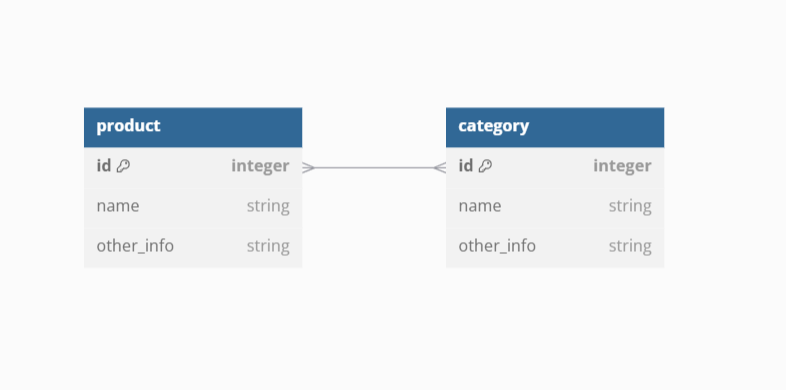
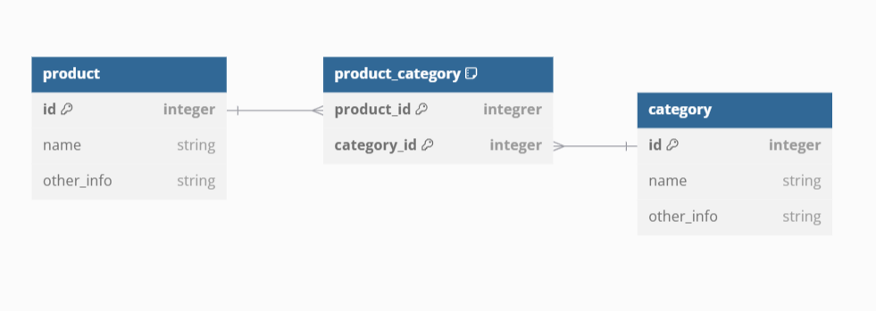

# Db-test

В базе данных MS SQL Server есть продукты и категории. Одному продукту может соответствовать много категорий, в одной категории может быть много продуктов. Напишите SQL запрос для выбора всех пар «Имя продукта – Имя категории». Если у продукта нет категорий, то его имя все равно должно выводиться.

# Solution
There is "M-to-M" relationship between the relations "product" and "category":
 

This relationship is transformed into 2 "1-to-M" relationships using junction relation:
 

The SQL request is here:
[Solution](./Request.sql)